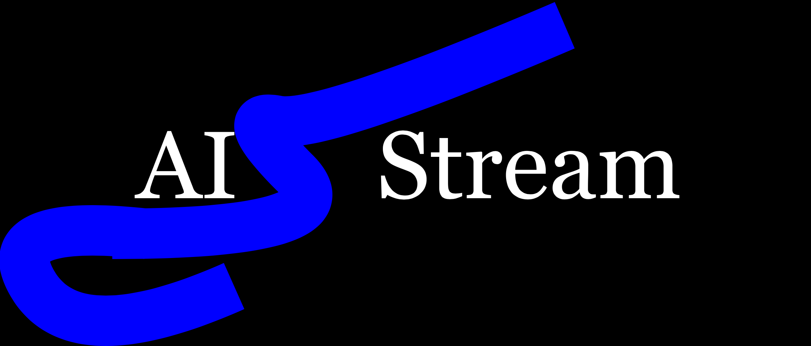

## PyData Orono

PyData Orono is the Orono, ME branch of [PyData](https://pydata.org) and the only PyData chapter north of Boston in the eastern U.S. We welcome people from all over who are interested in data science regardless of prior experience. 

### Upcoming Events 

We generally host meetups once per month in Orono (and ocassionally Bangor). The majority of meetups contain a presentation followed by open ended discussion about the topic. Ocassionally, we host informal gatherings at local cafes or restaurants such as the Nest and Family Dog. For more details on upcoming meetups please see our [official meetup page](http://meetup.com/PyData-Orono/). If you are interested in presenting please message [igodfried@isaac26.com](igodfried@isaac26.com). We accept presentations that cover any aspect of data science from statistical analysis of data, to data manipulation/cleaning, to data visualization, to machine learning/AI. 

### Past Meetups
- 12/12/2018 Reinforcement Learning in the Real World
- 11/07/2018 Data Visualization Night [Video](https://vimeo.com/299723817) [Flyer](https://www.docdroid.net/J5vLybw/data-meetup-16.pdf)
- 09/26/2018 Chatbots, dialogue, and natural language generation [Flyer](https://drive.google.com/file/d/1ZtUXyVghyKL2OYvlpDjwnEzjOOCopQr0/view?usp=sharing)
- 07/11/2018 End to end machine learning: Taking an NLP model from idea to production
- 05/02/2018 Java unit annotations [Related paper](https://ieeexplore.ieee.org/document/8301759)
- 03/28/2018 Machine Learning for Creativity [Video](https://vimeo.com/279701497)
- 02/07/2018 Deep learning with limited data [Video](https://vimeo.com/279736081)
- 11/08/2018 Deep learnibyng for Chest X-Ray analysis
- 09/19/2017 Recommendation Systems [Flyer]()

### Additional information

### Sponsers 

[{:height="50%" width="50%"}](http://aistream.org)
[{:height="50%" width="50%"}](https://numfocus.org)
